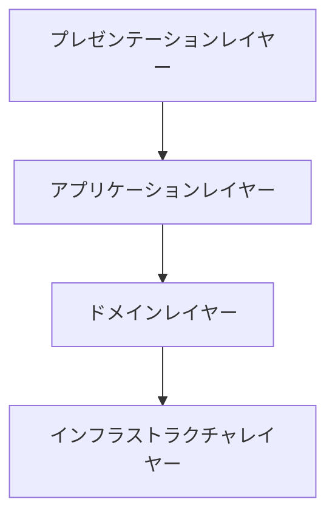

# LINE Bot エコーサーバー

このプロジェクトは、受信したテキストメッセージをそのまま返すシンプルなLINE Botです。DenoとLINE Messaging API SDKを使用して構築されています。

## 前提条件

- お使いのマシンにDenoがインストールされていること。
- LINE Developers Consoleでアカウントを作成し、チャンネルを設定していること。

## セットアップ

1. リポジトリをクローンし、プロジェクトディレクトリに移動します。

2. ルートディレクトリに`.env`ファイルを作成し、LINE Botの認証情報を追加します。

   ```plaintext
   CHANNEL_ACCESS_TOKEN=YOUR_CHANNEL_ACCESS_TOKEN
   CHANNEL_SECRET=YOUR_CHANNEL_SECRET
   ```

   `YOUR_CHANNEL_ACCESS_TOKEN`と`YOUR_CHANNEL_SECRET`をLINE Developers Consoleから取得した実際の認証情報に置き換えてください。

3. サーバーを起動します。

   ```bash
   deno run --allow-net --allow-env src/index.ts
   ```

   サーバーはポート3000で起動します。環境変数`PORT`を設定することでポートを変更できます。

## アーキテクチャ

このプロジェクトはレイヤードアーキテクチャを採用しています。以下の図はその構造を示しています：



以下のレイヤーで構成されています：

1. **プレゼンテーションレイヤー**: ユーザーからの入力を受け取り、レスポンスを返します。このプロジェクトでは、Expressサーバーがこの役割を果たしています。

2. **アプリケーションレイヤー**: ビジネスロジックを処理します。LINE Botのメッセージを受け取り、適切なレスポンスを生成します。

3. **ドメインレイヤー**: アプリケーションのコアビジネスロジックを含みます。メッセージの処理や返信の生成などが含まれます。

4. **インフラストラクチャレイヤー**: 外部サービスやデータベースとのやり取りを管理します。このプロジェクトでは、LINE Messaging APIとの通信が含まれます。

このアーキテクチャにより、各レイヤーが独立して開発・テストでき、保守性が向上します。

## 使用方法

- Botは受信したテキストメッセージをそのまま返します。
- LINE Developers ConsoleでWebhook URLが正しくサーバーを指していることを確認してください。

## ライセンス

このプロジェクトはMITライセンスの下でライセンスされています。
